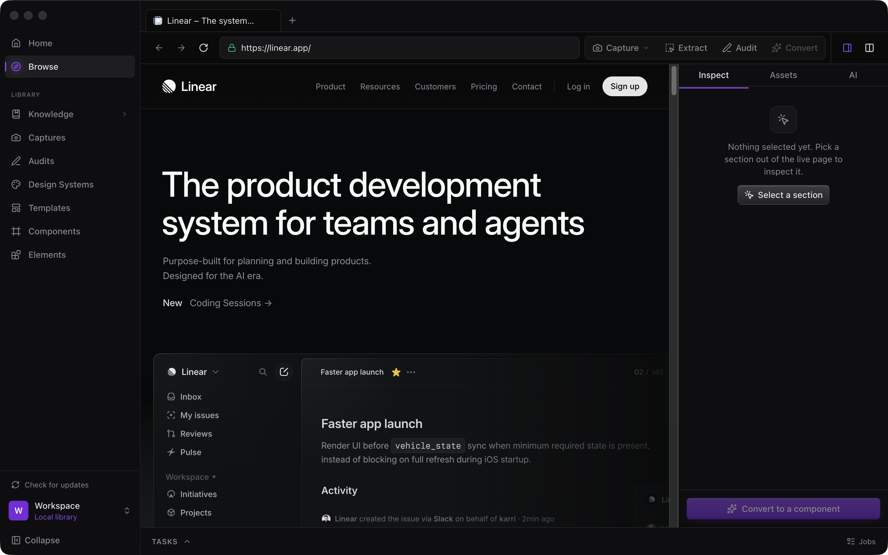
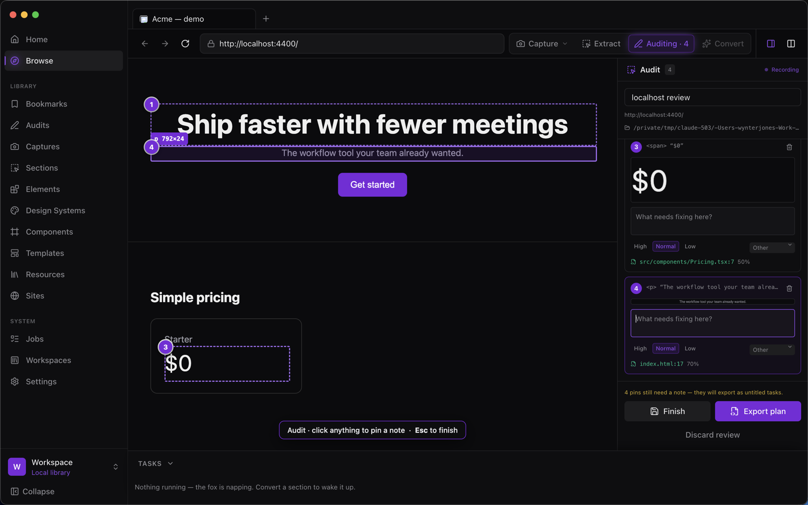
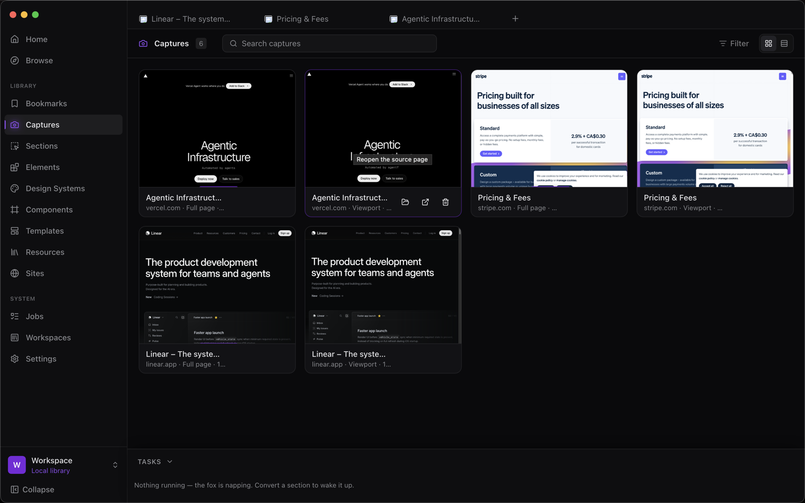

<div align="center">


### Browse. Capture. Compound.

A desktop browser for designers and developers whose browsing should leave something behind.

[](LICENSE)
[](https://electronjs.org)
[](https://react.dev)
[](https://github.com/WynterJones/Nisaba/releases)
[](#privacy)



<sub>Extract mode — hover the live page, walk the DOM with the arrow keys, click to keep everything about a region.</sub>

</div>

---

## Why

You find a pricing section you love. You screenshot it. Three months later you have a folder of
4,000 PNGs named `Screenshot 2026-04-11 at 14.22.03.png` and no idea which site any of them came
from, what fonts they used, or how the layout worked.

Nisaba is the browser that fixes that. You browse normally — but every capture keeps its source
URL, its DOM, its CSS, its fonts, its design tokens and its provenance. The library gets more
useful the longer you use it, and when you want the pattern back, an agent turns it into real code
in your stack.

**It is not your daily browser.** It's the one you open when your library needs to grow.

## What it does

**Browse** — multi-tab browsing where every site runs in its own isolated view: no Node, no preload
bridge, every permission denied by default.

**Capture** — the visible viewport, the whole scrollable page (via CDP, beyond the viewport), a
dragged region, or a picked element. Annotate with rectangles, arrows, highlight, blur, text and
numbered callouts, stored as editable vectors so the original PNG is never touched.

**Extract** — hover the page and the DOM outlines itself; arrow keys walk to parent, child or
sibling. Click and Nisaba keeps a robust selector, sanitized HTML, computed styles, CSS custom
properties, fonts, palette, assets and accessibility metadata — plus framework detection with a
confidence score and the evidence behind it.

**Audit** — review a page, live or on localhost, by clicking your way down it and pinning a note to
each thing that needs fixing. Every pin remembers the element, its computed styles and where it
sits on the page, then greps your workspace to find the file that renders it. Export the lot as a
folder of tasks an agent can work straight through.



**Profile** — measure the colours, type scale, spacing, radii, shadows, breakpoints and `:root`
variables a page actually uses, into an editable `design.md` and `tokens.json`. Observed values and
inferred ones stay labelled apart.

**Element Style Matrix** — find the buttons, inputs, cards and badges on a page, collapse visually
identical instances into variants, and screenshot each interaction state the page really declares
rules for.

**Compare** — two captures side by side, overlaid with an opacity slider, or as a pixel difference
computed locally, with a percentage-changed readout.

**Organize** — Captures, Sections, Elements, Design Systems, Audits, Resources, Sites and
Bookmarks, all searchable, filterable and on your own disk. Export the whole library as a plain
folder and import it back with IDs and relationships intact.

**Convert** — hand a saved section to the Claude Code or Codex CLI you already have installed.
Nisaba writes a source package, shows you the resolved prompt and the exact folder before anything
runs, streams the log, and records what was produced with a trail back to its sources.



## Also in 1.0

**Similarity** — every image is perceptually hashed as it is saved, so the library can find
near-duplicates and answer "what else looks like this" without leaving your machine.

**Verify** — a component can run your project's own lint, type, test and build scripts, in order,
stopping at the first failure. It is only marked verified when they all pass, or when you
explicitly override a failure.

**Preview** — start the workspace's dev server from inside Nisaba, open what it serves in a tab,
and compare it against the source capture it was built from.

**SQLite** — the library is a real database with full-text search, using Node's built-in driver.
No native module, nothing to rebuild per platform. An older JSON index is migrated on first run and
kept alongside as `index.json.migrated`.

## Install

**macOS** builds are published on the [Releases](https://github.com/WynterJones/Nisaba/releases)
page, and the app updates itself from there.

Windows and Linux aren't shipped yet, but nothing in Nisaba is macOS-specific — build it yourself
with the steps in [Develop](#develop) below. There is no account, no sign-in and no server; the
whole thing runs on your machine.

## Develop

```bash
git clone https://github.com/WynterJones/Nisaba.git
cd Nisaba
npm install
npm run dev
```

| Command | What it does |
| --- | --- |
| `npm run dev` | Dev build with hot reload |
| `npm run build` | Type-check and build to `out/` |
| `npm run dist` | Build a local installer into `dist/` |
| `npm run release` | Build all platforms and publish to GitHub Releases |

### Layout

```text
src/
  main/
    browser.ts     Tab lifecycle and isolated WebContentsViews
    capture.ts     Viewport, full-page (CDP) and region screenshots
    extract.ts     The in-page selection overlay and artifact collector
    design.ts      Whole-page token measurement and design.md generation
    audit.ts       The page-review overlay and pin context collector
    sourcemap.ts   Grepping a workspace to find what renders an element
    elements.ts    Primitive detection and per-state capture
    workspaces.ts  Folder selection, probing and the write boundary
    jobs.ts        Prompt resolution, agent spawning, output detection
    exporter.ts    Portable library export and import
    library.ts     On-disk index, the nisaba:// asset protocol
    agents.ts      CLI discovery and version probing
  preload/         The narrow typed bridge; the only surface the app UI can call
  renderer/        React + Tailwind + shadcn/ui application UI
_PLANS/            Product requirements and design references
```

## Architecture

Three trust levels, and remote pages sit at the bottom of all of them:

- **Main process** — owns windows, the database, the filesystem, screenshots and any CLI it
  launches. Nothing else touches those.
- **App renderer** — the Nisaba UI. Talks to main through one typed IPC surface, never Node.
- **Remote page views** — every site you browse, in its own `WebContentsView` with
  `nodeIntegration: false`, `contextIsolation: true`, sandbox on, no preload bridge and every
  permission denied by default.

Text scraped from a webpage is treated as **data, never instructions** — including when it is
packaged up and handed to an agent. Every job runs with its workspace folder as the working
directory, and the resolved prompt opens by telling the agent that everything in the source package
is untrusted third-party content.

## Privacy

No account. No cloud. Your captures, prompts and generated code stay on your machine, and the only
thing that ever leaves it is what you explicitly send through an agent CLI you installed and
authenticated yourself. Diagnostics are opt-in and off.

## Made by

[Wynter Jones](https://wynter.ai).

## Contributing

Issues and pull requests are welcome. Phase-scoped work is easiest to review — check the current
phase in [Status](#status) and in the PRD before starting something large.

## Name

[Nisaba](https://en.wikipedia.org/wiki/Nisaba) was the Sumerian goddess of writing, accounting and
the scribal arts — the one who kept the records. Fitting for a tool whose whole job is making sure
what you found doesn't get lost.

## License

MIT © [Wynter Jones](https://github.com/WynterJones)

<div align="center">


<sub>Off they go with the evidence.</sub>

</div>
