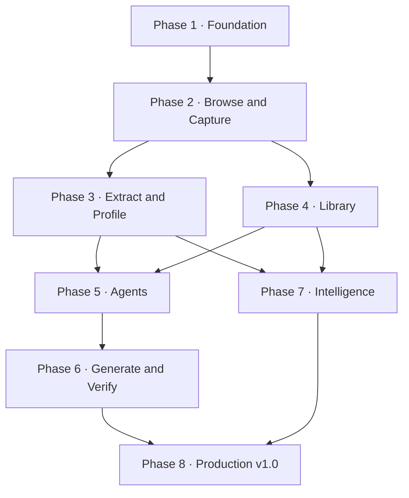

# Nisaba Product Requirements Document

**Product:** Nisaba  
**Tagline:** Browse. Capture. Compound.  
**Platform:** Desktop application for macOS, Windows, and Linux  
**Recommended shell:** Electron  
**Document status:** Build-ready v1 specification  
**Release definition:** Completion of Phases 1–8 constitutes Nisaba v1.0

---

## 1. Product Summary

Nisaba is a purpose-built desktop browser for web designers and developers who want their browsing to produce a permanent, reusable design library.

It is not intended to replace a general-purpose daily browser. It is a focused research, capture, extraction, organization, and conversion environment. A user browses a live website, selects useful pages or elements, saves the visual and technical source material, organizes it into a structured local library, and optionally asks Claude Code CLI or Codex CLI to convert it into reusable HTML, React, Tailwind, shadcn/ui, or another configured output.

Nisaba turns web inspiration into durable artifacts:

- Annotated screenshots
- Full-page captures
- Section and element captures
- HTML and relevant CSS
- Design tokens and `design.md`
- Site technology profiles
- Saved element styles and states
- Bookmarks and open-source resources
- Generated components and templates
- Source lineage and verification records

The product's core promise is compounding value: the more the user browses with Nisaba, the more useful their personal design corpus becomes.

---

## 2. Vision

Create the best local-first browser for turning web design research into a reusable, searchable, implementation-ready system.

Nisaba should make a designer feel that browsing is productive work. A captured pricing section should not disappear into an unorganized screenshot folder. It should become a searchable record containing the screenshot, source URL, DOM structure, styles, design tokens, notes, responsive variants, dependencies, generated implementation, and provenance.

### Product thesis

Existing tools usually solve only one part of the workflow:

- Browsers display the site.
- Screenshot tools save pixels.
- Bookmark managers save links.
- BuiltWith-style tools identify technologies.
- Inspiration galleries organize screenshots.
- Developer tools inspect source code.
- Coding agents recreate components.

Nisaba combines these activities around one structured local library.

---

## 3. Goals

### Primary goals

1. Make it extremely fast to capture anything useful while browsing.
2. Preserve both visual and technical context for every captured artifact.
3. Build an organized library of sites, captures, sections, elements, styles, systems, templates, and resources.
4. Extract a practical design profile from a page or site.
5. Convert captured references into generic, reusable code using the user's installed agent CLI.
6. Verify generated work visually before adding it to the reusable library.
7. Keep user data, screenshots, prompts, and generated code local by default.
8. Retain clear provenance so the user always knows where an artifact came from.

### Success criteria

- A user can capture and catalog a useful section in under 15 seconds.
- A saved section contains enough information to recreate its layout without revisiting the source.
- A user can find a previously saved design pattern without remembering its source site.
- A user can generate a framework-specific component from a saved section and preview it inside Nisaba.
- A user can compare the generated result against the source capture and iterate with the agent.
- The library remains responsive with at least 10,000 stored artifacts.

---

## 4. Non-Goals

Nisaba v1 will not:

- Replace Chrome, Safari, Edge, or Firefox for general daily browsing.
- Implement browser account sync, password management, ad blocking, or a general extension ecosystem.
- Promise perfect recovery of a site's original source code or build system.
- Circumvent authentication, paywalls, access controls, robots restrictions, or anti-bot systems.
- Automatically publish generated templates or components to a public marketplace.
- Provide cloud collaboration or multi-user workspaces.
- Operate Claude or Codex without the user installing and authenticating the relevant CLI.
- Guarantee that detected libraries or frameworks are correct; detections must include confidence and evidence.
- Encourage direct redistribution of copyrighted branding, copy, photography, or proprietary code.

---

## 5. Target Users

### Primary user: design-minded developer

A developer who regularly browses landing pages, dashboards, SaaS products, component libraries, and marketing sites for inspiration. They want to capture patterns and turn them into React, Tailwind, shadcn/ui, HTML, Rails partials, or another preferred stack.

### Secondary user: conversion and marketing designer

A designer who studies funnels, landing pages, offers, pricing sections, forms, testimonials, and calls to action. They care about layout, typography, hierarchy, visual states, copy structure, and reusable marketing patterns.

### Secondary user: component library curator

A user building a large private collection of buttons, forms, navigation systems, heroes, pricing sections, icon libraries, design systems, and templates. Search, tagging, deduplication, comparison, and provenance are critical.

---

## 6. Product Principles

1. **Capture first.** Capturing an idea must never require configuring an AI job.
2. **Deterministic before generative.** Save factual visual and technical evidence before asking an agent to interpret it.
3. **Everything has provenance.** Preserve source URL, capture time, viewport, selection, and transformation history.
4. **Local-first.** Store the working library and generated code on the user's computer.
5. **User-owned folders.** Users decide where libraries, projects, templates, and components live.
6. **Structured, not piled.** Screenshots, code, tokens, notes, tags, and source records belong to related typed objects.
7. **Transformation over cloning.** Genericize content and assets by default while preserving useful layout theory and patterns.
8. **Agents are replaceable adapters.** The product workflow must not depend on one model vendor or CLI output format.
9. **Background work remains visible.** Long-running agent and capture jobs expose progress, logs, cancellation, and results.
10. **Remote pages are untrusted.** A webpage can never directly invoke native APIs, filesystem operations, or CLI processes.

---

## 7. Core Product Model

Nisaba stores related artifact types rather than treating everything as a screenshot.

| Artifact | Purpose | Required contents |
| --- | --- | --- |
| Site | Canonical record for a domain | Domain, title, favicon, notes, tags, captures, detected technology |
| Bookmark | Organized reference to a URL | URL, title, description, tags, collection, notes, status |
| Capture | Visual record of a page or region | Image, URL, timestamp, viewport, annotation document, page metadata |
| Section | Reusable page region | Screenshot, selector, bounding box, sanitized HTML, styles, assets, source |
| Element Style | Normalized UI primitive | Element type, variants, states, tokens, screenshots, implementations |
| Design System | Extracted design language | Colors, typography, spacing, radii, shadows, grid, breakpoints, motion |
| Resource | Useful external library or tool | Type, URL, repository, package, license, notes, tags |
| Component | Generated reusable implementation | Files, framework, preview, inputs, prompt profile, source lineage |
| Template | Generated page or multi-section implementation | Files, pages, assets, preview command, sources, versions |
| Workspace | Filesystem and agent context | Root folder, output stack, prompts, agent, commands, settings |
| Agent Job | Background conversion or analysis run | Inputs, prompt, adapter, events, logs, output, status, timestamps |

### Core relationships

- A Site has many Bookmarks, Captures, Sections, Design Systems, and Resources.
- A Capture may contain many Sections or annotations.
- A Section may produce many Components.
- Many Sections may produce one Template.
- An Element Style may be derived from many Sections across many Sites.
- Every generated Component or Template must reference its source artifacts and Agent Job.

---

## 8. Information Architecture

### Persistent application navigation

- Home
- Browse
- Bookmarks
- Captures
- Sections
- Elements
- Design Systems
- Components
- Templates
- Resources
- Sites
- Jobs
- Workspaces
- Settings

### Main browsing workspace

The browsing workspace uses four regions:

1. **Browser chrome:** tabs, navigation, URL field, viewport controls, capture, extract, and convert actions.
2. **Library sidebar:** navigation, collections, recent projects, saved searches, and item counts.
3. **Live page viewport:** the remote website with optional selection, ruler, grid, and measurement overlays.
4. **Inspector panel:** selected element details, assets, style data, site profile, notes, and agent actions.

A collapsible bottom drawer displays background jobs, progress, logs, warnings, approvals, cancellation, and completed results.

### Home screen

The home screen includes:

- Search or URL entry
- Quick capture actions
- Recent captures
- Recent sites
- Active workspace
- Current agent and output profile
- Background jobs
- Saved design systems
- Recently used resources
- Library statistics

### Library views

All library types support:

- Grid and table views
- Sort and filter
- Tags and collections
- Saved searches
- Bulk actions
- Notes
- Source navigation
- Preview drawer
- Related artifacts
- Duplicate suggestions
- Export

---

## 9. Core Workflows

### 9.1 Capture a visible page

1. User navigates to a site.
2. User selects **Capture viewport**.
3. Nisaba captures the current page without application chrome.
4. User may immediately annotate, tag, describe, and place it in a collection.
5. Nisaba stores the capture under the canonical Site record.

### 9.2 Capture a full page

1. User selects **Capture full page**.
2. Nisaba measures the complete page and captures beyond the current viewport.
3. Sticky and fixed elements are normalized to avoid unwanted repetition where possible.
4. Capture progress is shown for unusually long pages.
5. The user may crop, annotate, tag, and save the result.

### 9.3 Extract a section

1. User activates **Select section**.
2. Hovering outlines DOM elements and displays semantic labels and dimensions.
3. Keyboard controls allow moving to parent, child, previous sibling, or next sibling.
4. User clicks the desired region.
5. Nisaba captures its screenshot, source context, HTML, relevant styles, assets, fonts, tokens, and selector.
6. User assigns a semantic type such as Hero, Pricing, Navigation, Form, Testimonial, or Footer.
7. Nisaba saves it as a Section and optionally as one or more Element Styles.

### 9.4 Capture an element system

1. User chooses a common element category such as Buttons or Inputs.
2. Nisaba detects candidates on the current page.
3. User selects which instances to save.
4. Nisaba records default, hover, focus, active, disabled, checked, open, or expanded states when available.
5. The items appear in the Element Style Matrix for comparison across sites.

### 9.5 Create a site profile

1. User selects **Create site profile**.
2. Nisaba analyzes the current page and optionally a user-approved set of same-origin pages.
3. Nisaba extracts design tokens, typography, layout conventions, reusable assets, and technology evidence.
4. It generates editable `design.md`, `tokens.json`, and `site-profile.json` artifacts.
5. The profile is stored locally and displayed in the Design Systems library.

### 9.6 Convert a section to a component

1. User opens a saved or currently selected Section.
2. User selects an output profile, destination workspace, and agent.
3. Nisaba previews the exact sources, prompt hierarchy, and target folder.
4. User starts the job.
5. Nisaba launches the configured CLI inside the approved workspace.
6. Logs and structured events stream into the Jobs drawer.
7. Nisaba starts or refreshes the generated preview.
8. User compares the result with the source and requests corrections.
9. The verified result becomes a Component with complete lineage.

### 9.7 Convert multiple sections into a template

1. User selects Sections from one or more Sites.
2. User orders them in a template outline.
3. User selects a conversion profile and chooses whether to preserve or genericize each source characteristic.
4. Nisaba creates a job package containing screenshots, source summaries, assets, tokens, and instructions.
5. The agent builds the template inside the chosen folder.
6. Nisaba previews, captures, and compares the result.
7. The completed implementation is added to Templates.

### 9.8 Save and organize a web resource

1. User bookmarks an icon library, UI library, font collection, code repository, or design tool.
2. Nisaba classifies the resource and stores its URL, description, tags, package or repository metadata, and license when available.
3. Related captured Sites, Sections, and Components appear alongside it.

---

## 10. Functional Requirements

### 10.1 Browser

- BR-001: Support multiple tabs with back, forward, reload, stop, duplicate, close, and reopen-closed-tab behavior.
- BR-002: Support standard URL navigation and web search from the address field.
- BR-003: Display title, favicon, loading state, security state, and navigation errors.
- BR-004: Persist tab sessions and restore them after a normal restart or crash.
- BR-005: Support per-workspace browser sessions and isolated cookie partitions.
- BR-006: Support common keyboard shortcuts for tabs, navigation, capture, and selection.
- BR-007: Support configurable desktop, tablet, mobile, and custom viewports.
- BR-008: Allow opening a link in the system's default browser.
- BR-009: Provide an optional responsive ruler, grid overlay, spacing inspector, and contrast checker.
- BR-010: Clearly identify pages or actions that Nisaba cannot capture or inspect.

### 10.2 Screenshot capture and annotation

- CAP-001: Capture the visible page viewport without Nisaba UI.
- CAP-002: Capture a full scrollable page.
- CAP-003: Capture a selected DOM element or manually drawn region.
- CAP-004: Capture multiple configured viewports as one batch.
- CAP-005: Support PNG, JPEG, and WebP exports.
- CAP-006: Store original image separately from annotations.
- CAP-007: Store annotation layers as editable vector JSON.
- CAP-008: Provide rectangle, ellipse, arrow, line, text, blur, highlight, freehand, and numbered callout tools.
- CAP-009: Support crop, copy, export, recapture, and compare.
- CAP-010: Save capture URL, timestamp, title, viewport, scale factor, scroll position, and page metadata.
- CAP-011: Allow a capture to be attached to a Site, collection, Section, Component, Template, or Agent Job.

### 10.3 DOM, CSS, and asset extraction

- EXT-001: Outline hovered elements without permanently modifying the source document.
- EXT-002: Allow precise DOM navigation by parent, child, and sibling.
- EXT-003: Record a robust selector plus fallback selector strategies.
- EXT-004: Save sanitized `outerHTML` for the selected region.
- EXT-005: Collect matched CSS rules, computed styles, inherited styles, pseudo-element styles, and CSS variables relevant to the region.
- EXT-006: Detect fonts, images, icons, video, SVG, background assets, and relevant external stylesheets.
- EXT-007: Download user-approved assets into the artifact package.
- EXT-008: Record bounding box, stacking context, layout mode, grid or flex properties, and responsive behavior.
- EXT-009: Capture accessibility role, accessible name, labels, heading level, and notable violations.
- EXT-010: Record extraction warnings when cross-origin frames, browser restrictions, or inaccessible styles prevent complete collection.
- EXT-011: Strip scripts, event handlers, tracking identifiers, user data, form values, and secrets from saved HTML by default.

### 10.4 Technology and open-source detection

- TECH-001: Detect likely frameworks, CSS systems, fonts, analytics, icon systems, component libraries, CMS products, and build clues.
- TECH-002: Store a confidence score and supporting evidence for every detection.
- TECH-003: Never present heuristic detection as definitive fact.
- TECH-004: Connect known packages to their documentation, repository, license, and saved Resource record when available.
- TECH-005: Allow users to correct, dismiss, or confirm a detection.
- TECH-006: Reuse corrections to improve future local classification.

### 10.5 Design system extraction

- DS-001: Extract observed colors and infer editable semantic roles.
- DS-002: Extract font families, weights, sizes, line heights, tracking, and typography hierarchy.
- DS-003: Infer spacing, sizing, radius, border, and shadow scales from observed values.
- DS-004: Record containers, columns, grids, alignment, breakpoints, and responsive rules.
- DS-005: Capture buttons, inputs, cards, navigation, badges, alerts, forms, and common element states.
- DS-006: Record animation and transition patterns where observable.
- DS-007: Generate editable `design.md`, `tokens.json`, `fonts.json`, and `site-profile.json`.
- DS-008: Clearly distinguish observed values from inferred tokens.
- DS-009: Allow merging selected tokens into an existing user design system.
- DS-010: Support visual comparison of multiple saved Design Systems.

### 10.6 Element Style Matrix

- ELM-001: Normalize saved primitives into categories such as Button, Input, Select, Checkbox, Radio, Card, Badge, Alert, Navigation, Modal, Table, and Pricing Card.
- ELM-002: Store variants and interaction states independently.
- ELM-003: Compare saved examples across Sites in a grid.
- ELM-004: Filter by visual attributes, technology, site, state, and user tags.
- ELM-005: Promote a saved Element Style into a generated Component.
- ELM-006: Associate an Element Style with one or more user-owned Design Systems.
- ELM-007: Identify visually near-duplicate element styles.

### 10.7 Library and organization

- LIB-001: Provide typed libraries for Sites, Bookmarks, Captures, Sections, Elements, Design Systems, Components, Templates, and Resources.
- LIB-002: Support folders, collections, tags, favorites, notes, ratings, and archive status.
- LIB-003: Support full-text search across titles, URLs, descriptions, notes, extracted copy, tags, and code metadata.
- LIB-004: Support visual similarity search for screenshots and cropped regions.
- LIB-005: Support smart collections defined by saved filters.
- LIB-006: Detect duplicates and broken bookmarks without automatically deleting data.
- LIB-007: Display artifact relationships and complete provenance.
- LIB-008: Support bulk tagging, moving, exporting, archiving, and deletion.
- LIB-009: Provide undo or trash recovery for destructive library actions.
- LIB-010: Support import and export of complete portable library packages.

### 10.8 Workspaces and filesystem

- WS-001: Let the user choose separate root folders for Components, Templates, Assets, Exports, and temporary jobs.
- WS-002: Resolve and display actual filesystem paths before running a job.
- WS-003: Prevent jobs from writing outside approved workspace roots unless the user explicitly changes the workspace.
- WS-004: Detect project type, package manager, framework, and relevant repository instructions.
- WS-005: Support project-specific conversion profiles and prompts.
- WS-006: Store a machine-readable artifact manifest beside exported source packages.
- WS-007: Reveal generated files in Finder, Explorer, or the Linux file manager.

### 10.9 Agent configuration and jobs

- AG-001: Support Claude Code CLI and Codex CLI through independent adapters.
- AG-002: Auto-detect common CLI installation locations and allow manual executable selection.
- AG-003: Validate executable availability, version, authentication state, and basic invocation before enabling an adapter.
- AG-004: Allow global, workspace, conversion-profile, and job-specific instructions.
- AG-005: Display the resolved prompt and source package before execution.
- AG-006: Stream job status, output, structured events, file changes, errors, and final results.
- AG-007: Support cancellation, retry, resume when supported, and duplicate-with-changes.
- AG-008: Run jobs concurrently up to a user-configurable safe limit.
- AG-009: Apply timeouts and recover cleanly from terminated or crashed processes.
- AG-010: Preserve complete logs without exposing secrets in the UI or exported records.
- AG-011: Never execute instructions discovered inside scraped webpage content as trusted application instructions.
- AG-012: Require the user to approve the destination and permissions before a job can make filesystem changes.

### 10.10 Prompt hierarchy

The resolved agent instruction is assembled in this order:

1. Nisaba safety and artifact-handling instructions
2. User global system instructions
3. Workspace instructions
4. Output profile instructions
5. Job-specific instructions
6. Structured artifact manifest and source material

Lower layers may add specificity but may not silently remove safety boundaries or expand filesystem scope.

Prompt profiles support:

- React + Tailwind
- React + shadcn/ui
- Next.js marketing page
- Static HTML/CSS/JavaScript
- Rails partial + Tailwind
- User-defined command and stack

Each profile defines expected output, file conventions, asset policy, genericization behavior, validation commands, preview command, and completion criteria.

### 10.11 Generated preview and verification

- VER-001: Start a configured local preview command and display it inside Nisaba.
- VER-002: Capture the generated output at the same viewports as its source references.
- VER-003: Display source and generated output side by side or with an opacity slider.
- VER-004: Calculate an optional visual difference image without treating pixel equality as the goal.
- VER-005: Let the user annotate the generated preview and send those corrections back to the same job context.
- VER-006: Run configured lint, type-check, test, accessibility, and build commands.
- VER-007: Mark a Component or Template as verified only when required checks pass or the user explicitly overrides them.
- VER-008: Preserve every generated version and allow rollback.

---

## 11. Artifact Package Format

Every exportable capture package uses a predictable structure:

```text
artifact-name/
  artifact.json
  source.json
  notes.md
  screenshot.png
  annotations.json
  html/
    selected.html
    context.html
  styles/
    matched.css
    computed.json
    variables.json
  assets/
  fonts/
  technology.json
  accessibility.json
```

A complete Site Design Pack uses:

```text
site-name-design-pack/
  design.md
  tokens.json
  fonts.json
  site-profile.json
  sources.json
  screenshots/
  sections/
  elements/
  assets/
```

Generated Components and Templates add:

```text
generated-artifact/
  nisaba.json
  sources/
  implementation/
  verification/
  jobs/
```

The `nisaba.json` manifest records artifact IDs, source relationships, output profile, agent adapter, job ID, creation time, verification state, and relevant commands. It must not contain authentication tokens or secrets.

---

## 12. Recommended Technical Architecture

### 12.1 Desktop shell

Use Electron because the live browsing and inspection surface is the core product.

- **Application UI:** React, TypeScript, Tailwind CSS, shadcn/ui
- **App window:** Electron `BaseWindow` or `BrowserWindow`
- **Remote page tabs:** isolated `WebContentsView` instances
- **Browser instrumentation:** Electron `webContents`, Chrome DevTools Protocol, and content-script-style injected selectors
- **Local database:** SQLite with full-text search
- **Images:** filesystem-backed originals and derivatives, referenced by database IDs
- **Background work:** Electron utility processes or Node workers
- **CLI integration:** child processes launched only from the trusted main process
- **Preview:** isolated local `WebContentsView` using a workspace preview URL

### 12.2 Process boundaries

#### Trusted main process

Responsible for:

- Window and tab lifecycle
- Filesystem access
- Database access
- Screenshot orchestration
- CLI discovery and process execution
- Native dialogs
- Permission enforcement
- Update and crash recovery

#### Trusted application renderer

Responsible for:

- Nisaba UI
- Library views
- Annotation editor
- Inspector panels
- Job presentation
- Search and organization interactions

It communicates through a narrow, typed IPC API.

#### Untrusted remote page renderer

Every browsed website runs with:

- `nodeIntegration: false`
- `contextIsolation: true`
- sandbox enabled
- no direct native or database IPC
- no general-purpose preload bridge
- navigation and new-window handling controlled by the main process
- permissions denied by default and brokered explicitly

#### Worker or utility processes

Responsible for expensive or failure-prone operations:

- Image processing
- Full-page capture assembly when necessary
- DOM and CSS normalization
- Search indexing
- Similarity embeddings
- Technology detection
- Export packaging

### 12.3 Agent adapter contract

Both Claude and Codex integrations implement the same internal interface:

```ts
interface AgentAdapter {
  id: string
  detect(): Promise<AgentInstallation>
  validate(): Promise<ValidationResult>
  buildInvocation(job: AgentJob): ProcessInvocation
  parseEvent(line: string): AgentEvent | null
  cancel(jobId: string): Promise<void>
  capabilities(): AgentCapabilities
}
```

The Codex adapter should use supported non-interactive execution with structured event output when available. Adapter commands and flags must be version-aware rather than scattered throughout the application.

### 12.4 Storage strategy

SQLite stores metadata, relationships, tags, notes, settings, jobs, search indexes, and relative file paths. Large screenshots, assets, logs, artifact packages, and generated project files remain on disk.

Database migrations must be versioned, reversible where practical, and backed up before destructive schema changes.

### 12.5 Search strategy

V1 search layers:

1. SQLite full-text search for text and metadata
2. Faceted filtering for type, tag, site, technology, color, typography, and date
3. Perceptual hashes for exact and near-duplicate images
4. Local image embeddings for visual similarity in Phase 7

---

## 13. Security and Trust Requirements

1. Remote pages never receive access to Electron, Node.js, filesystem, database, native messaging, or CLI methods.
2. Browsed content is treated as untrusted data, including text included in an agent source package.
3. Saved HTML is sanitized; scripts, inline handlers, authentication values, hidden form values, tracking parameters, and personal data are removed by default.
4. Agent jobs run only in a user-selected workspace.
5. Nisaba displays command, working directory, agent, and permission profile before the first write-enabled run in a workspace.
6. Credentials are never copied into job manifests, logs, prompts, or export packages.
7. Agent output cannot silently change Nisaba application files.
8. Network access and filesystem scope are configurable per workspace where supported by the selected agent.
9. New windows, downloads, camera, microphone, geolocation, notifications, clipboard, and protocol handlers are denied or explicitly brokered.
10. Destructive library actions use trash or a recoverable state before permanent deletion.

### Ethical and provenance safeguards

- Generated profiles distinguish observed facts from AI inference.
- Captured artifacts retain the source URL and time.
- Asset downloading is user-initiated.
- Genericization is the default conversion behavior.
- Users can label source licensing or permission status.
- Exported packages include provenance unless the user explicitly removes it.

---

## 14. Phased Delivery Plan

### How to execute the phases

Phases are additive. Complete them in numeric order unless the dependency map explicitly permits parallel work. Within a phase, the listed workstreams may be assigned to separate agents or developers in parallel after shared interfaces and file ownership are agreed.

Each phase must end with:

- Integrated code on the main branch
- Passing automated checks
- Updated database migrations
- Documented manual verification
- No abandoned placeholder flows in that phase's scope
- A usable shippable state



### Phase 1 — Application Foundation

**Shippable outcome:** A secure desktop shell with persistent navigation, an empty typed library, settings, workspaces, and a remote browsing proof of concept.

#### Scope

- Electron application shell
- React application UI and design system
- Secure `WebContentsView` proof of concept
- Typed IPC boundary
- SQLite database and migration system
- Core artifact schema
- Filesystem root selection
- Workspace creation and settings
- Basic logging and error handling
- Unit, integration, and application smoke-test harness

#### Parallel workstreams

- **1A — Desktop shell:** windows, remote view lifecycle, IPC, security defaults
- **1B — Application UI:** navigation, layout, theme, settings, empty states
- **1C — Data foundation:** SQLite, repositories, migrations, artifact schemas
- **1D — Quality foundation:** test harness, fixtures, logging, CI packaging checks

These four tracks may run in parallel after agreeing on IPC types, database IDs, and top-level folder ownership.

#### Acceptance criteria

- App launches on the primary development platform.
- User can create a workspace and select valid folders.
- A remote page opens inside an isolated view.
- Remote content cannot call trusted IPC methods.
- Database persists a Site and Workspace record across restarts.
- Core navigation and settings render with the production theme.
- Smoke tests launch and close the packaged development app.

---

### Phase 2 — Browse and Capture

**Shippable outcome:** Nisaba is a useful visual research browser capable of tabs, bookmarks, viewport capture, full-page capture, region capture, annotation, and export.

#### Scope

- Tabs and navigation
- Session restoration
- Browser error and loading states
- Viewport presets
- Visible viewport capture
- Full-page capture
- Manual region capture
- Annotation editor
- Basic bookmarks and Sites
- Capture metadata and filesystem storage
- Capture history and export

#### Parallel workstreams

- **2A — Browser tabs:** navigation model, history, sessions, keyboard shortcuts
- **2B — Capture engine:** viewport, full page, region, image processing
- **2C — Annotation editor:** vector document, tools, undo, export rendering
- **2D — Capture persistence UI:** save flow, tags, basic Sites and Bookmarks

2A and 2B share browser-view interfaces. 2C can run independently against fixture images. 2D can run against mocked capture records until 2B is integrated.

#### Acceptance criteria

- User can browse normal public websites in multiple tabs.
- User can restore open tabs after restarting Nisaba.
- Viewport and full-page screenshots exclude Nisaba chrome.
- User can crop and annotate without altering the original capture.
- Capture metadata includes source URL, title, time, and viewport.
- Captures appear under their Site and can be exported.
- Capture failures produce actionable, non-destructive errors.

---

### Phase 3 — Extract and Profile

**Shippable outcome:** A user can select a live page section and save a complete technical artifact or generate a practical Site Design Pack.

#### Scope

- Hover selection overlay
- DOM hierarchy navigation
- Element and section screenshots
- HTML sanitization
- CSS rule and computed-style extraction
- Asset and font discovery
- Technology detection with evidence
- Common element detection
- Design token inference
- `design.md` and Site Design Pack generation
- Extraction warnings and diagnostics

#### Parallel workstreams

- **3A — Selection UX:** overlay, DOM navigation, measurements, inspector integration
- **3B — Extraction engine:** HTML, CSS, pseudo-elements, variables, assets, accessibility
- **3C — Site profiling:** technology evidence, fonts, tokens, layout and breakpoint inference
- **3D — Artifact packaging:** manifests, design pack writer, sanitization fixtures

3A can use mocked extraction responses. 3B and 3C can share captured page fixtures but should own separate modules. 3D begins after the artifact schema is frozen and can proceed in parallel with the second half of 3B and 3C.

#### Acceptance criteria

- User can reliably select nested page regions.
- Saved Section contains a screenshot, selectors, sanitized HTML, styles, assets, accessibility metadata, and source record.
- User can move selection to parent, child, and sibling elements.
- Site profile lists technologies with confidence and evidence.
- Generated design pack clearly labels observed and inferred values.
- Exported packages contain no scripts, saved form values, or authentication data by default.

---

### Phase 4 — Compounding Library

**Shippable outcome:** Nisaba becomes a fast, organized personal design corpus rather than a capture folder.

#### Scope

- Full typed library navigation
- Captures, Sections, Elements, Design Systems, Resources, Sites, and Bookmarks
- Grid and table views
- Collections, tags, notes, favorites, ratings, and archive
- Full-text search and facets
- Element Style Matrix
- Related-artifact and provenance views
- Bulk operations
- Trash and recovery
- Duplicate detection using hashes
- Portable export and import baseline

#### Parallel workstreams

- **4A — Library UI:** typed views, previews, details, relationships
- **4B — Search and organization:** FTS, filters, tags, smart collections
- **4C — Element Matrix:** normalization, state comparison, promotion flow
- **4D — Bookmarks and Resources:** metadata, library categories, status and licenses
- **4E — Data safety:** bulk operations, trash, recovery, portable packages

All tracks can run in parallel after query contracts and artifact repositories are stable. Each track should own separate routes and feature modules.

#### Acceptance criteria

- User can search 10,000 fixture artifacts without UI blocking.
- User can browse all saved examples of a common element type.
- User can organize icon libraries and other Resources separately from ordinary bookmarks.
- Every Section exposes its Site, Capture, extracted source, and generated descendants.
- Bulk changes can be reversed when they involve deletion or archiving.
- Duplicate captures are suggested without automatic deletion.

---

### Phase 5 — Agent and Job Infrastructure

**Shippable outcome:** Nisaba can safely launch, monitor, and manage Claude Code or Codex jobs using captured artifacts and user-controlled prompts.

#### Scope

- Agent adapter interface
- Claude Code CLI adapter
- Codex CLI adapter
- Installation and authentication validation
- Prompt hierarchy and editor
- Output profiles
- Background job queue
- Streaming logs and structured events
- Cancellation, retry, and recovery
- Concurrency control
- Workspace permission confirmation
- Prompt-injection boundaries

#### Parallel workstreams

- **5A — Agent adapters:** detection, validation, invocation, event parsing
- **5B — Prompt system:** profile editor, hierarchy, resolved-prompt preview
- **5C — Job engine:** queue, process lifecycle, concurrency, cancellation, recovery
- **5D — Jobs UI:** drawer, logs, history, errors, retry and result presentation
- **5E — Security review:** workspace boundary, untrusted source packaging, secret redaction

5A, 5B, 5C, and 5D may run in parallel against shared interfaces. 5E begins with interface review and continues through integration; it is not a final-only audit.

#### Acceptance criteria

- Nisaba detects or allows selection of authenticated CLI installations.
- User can edit global, workspace, profile, and job instructions.
- Resolved instructions and destination are visible before a write-enabled run.
- Jobs stream progress without freezing the application.
- User can cancel a running job and retry a failed job.
- A malformed or malicious captured page cannot expand job filesystem permissions.
- Job history survives application restarts.

---

### Phase 6 — Generate, Preview, and Verify

**Shippable outcome:** The complete core loop works: browse, capture, extract, convert, preview, compare, correct, verify, and save.

#### Scope

- Convert Section to Component
- Compose Sections into Template outline
- Agent source-package builder
- Generated-file discovery
- Local preview command management
- Preview `WebContentsView`
- Matched-viewport source and output captures
- Side-by-side and overlay comparison
- Annotation-to-agent correction loop
- Lint, build, type-check, test, and accessibility checks
- Component and Template versions
- Rollback and verified status

#### Parallel workstreams

- **6A — Conversion flows:** component and template configuration, source packaging
- **6B — Preview runtime:** command lifecycle, port detection, preview view, recovery
- **6C — Visual verification:** matched captures, overlay, differences, annotations
- **6D — Code verification:** configurable build, lint, test, and accessibility commands
- **6E — Versioning:** generated artifact history, rollback, verified state

6A and 6B can run in parallel. 6C uses fixture previews until 6B is stable. 6D operates against sample repositories independently. 6E starts once generated-artifact manifests are frozen.

#### Acceptance criteria

- User can turn a saved Section into a working configured-stack Component.
- User can assemble multiple Sections into a generated Template.
- Generated output runs in an isolated preview.
- User can compare source and generated output at matching viewports.
- User annotations can be sent back into the same correction workflow.
- Required validation commands run and are recorded.
- Verified Components and Templates appear in the library with complete lineage.
- User can restore a previous generated version.

---

### Phase 7 — Library Intelligence

**Shippable outcome:** Nisaba helps the user understand and reuse a large library instead of merely storing it.

#### Scope

- Automatic semantic classification
- Perceptual near-duplicate detection
- Local visual similarity search
- Related-design recommendations
- Cross-site element comparison
- Open-source package and repository matching
- Broken bookmark checks
- Site recapture and visual change comparison
- Suggested tags and collections
- User correction feedback

#### Parallel workstreams

- **7A — Classification:** section and element taxonomy, suggested tags
- **7B — Visual indexing:** hashes, embeddings, crop-to-search, similarity ranking
- **7C — Resource intelligence:** package matching, repository and license metadata
- **7D — Change tracking:** recapture, screenshot comparison, bookmark health
- **7E — Discovery UI:** related items, suggestions, explainable evidence, corrections

These tracks can run largely in parallel because they consume the stable Phase 4 artifact model. 7E should integrate mocked results early and real results incrementally.

#### Acceptance criteria

- New Sections receive editable category and tag suggestions.
- User can crop an image and find visually related captures or Sections.
- Nisaba identifies likely duplicates and explains why they match.
- Open-source matches include evidence and confidence rather than unsupported claims.
- User can compare an earlier capture with a recaptured version of a page.
- User corrections persist and influence future local organization.

---

### Phase 8 — Product Hardening and Nisaba v1.0

**Shippable outcome:** A complete, installable, recoverable, documented Nisaba v1.0 for macOS, Windows, and Linux.

#### Scope

- First-run onboarding
- CLI setup wizard
- Sample library and guided workflow
- Performance profiling and optimization
- Crash recovery and job recovery
- Database backup and integrity checks
- Import and export completion
- Accessibility and keyboard review
- Security review and threat-model closure
- Auto-update strategy
- Signed installers and packaging
- Privacy controls and optional diagnostics
- User documentation
- Release test matrix

#### Parallel workstreams

- **8A — Onboarding and documentation:** first run, examples, setup, help
- **8B — Reliability:** recovery, backups, migrations, integrity and long-run tests
- **8C — Performance:** tab memory, image processing, library search, startup
- **8D — Security and privacy:** final audit, permission UI, redaction, threat tests
- **8E — Distribution:** installers, signing, updates, release automation
- **8F — Cross-platform QA:** macOS, Windows, Linux and upgrade scenarios

All tracks may run in parallel after Phase 6 and Phase 7 integration freezes. Release is blocked until every track passes its v1 checklist.

#### Acceptance criteria

- A new user can install Nisaba, choose a library folder, configure an agent, capture a Section, and generate a Component without external instructions.
- Recovery tests prove that a crash does not corrupt the library or silently lose a running job record.
- Importing an exported library preserves IDs, relationships, files, and provenance.
- The application passes its security checklist on all supported platforms.
- Signed release installers pass clean-machine installation and upgrade tests.
- The complete browse → capture → extract → organize → generate → verify loop passes on every supported platform.

---

## 15. Parallel Development Rules

Parallel work is encouraged, but only when it reduces integration risk rather than multiplying it.

### Required coordination rules

1. Freeze shared types and contracts at the start of each phase.
2. Assign exclusive ownership for high-conflict files such as database schemas, IPC definitions, root navigation, and package configuration.
3. Develop workstreams in isolated branches or worktrees.
4. Use fixtures and mock adapters so UI, engine, and storage work can proceed independently.
5. Integrate small vertical slices throughout a phase instead of combining all branches at the end.
6. Require contract tests for IPC, repositories, artifact manifests, and agent events.
7. Do not begin a dependent phase merely because one parallel workstream is complete.
8. A phase is complete only after its workstreams are integrated and its acceptance criteria pass together.

### Recommended agent split

For a four-agent build loop:

- **Agent A:** Electron shell, browser views, IPC, native operations
- **Agent B:** React UI, library screens, annotation and inspector experiences
- **Agent C:** extraction, profiling, image processing, search intelligence
- **Agent D:** database, agent adapters, jobs, previews, verification and tests

Ownership may change by phase, but two agents should not edit the same foundational module simultaneously.

---

## 16. Non-Functional Requirements

### Performance targets

- Warm application start should feel immediate on a modern development computer.
- Normal navigation controls should respond without application-renderer blocking.
- Viewport captures should ordinarily complete within a few seconds.
- Search and filtering across 10,000 artifacts should update interactively.
- Expensive image and extraction tasks must run outside the UI renderer.
- Background jobs must not block browsing or library organization.
- Inactive remote tabs should be eligible for suspension while retaining state.

### Reliability

- Every database mutation involved in artifact creation must be transactional.
- Partially written captures and exports must be detected and recoverable.
- Jobs must record lifecycle transitions before launching external processes.
- Application restart must reconcile jobs left in an indeterminate state.
- Database backups must occur before irreversible migrations.

### Accessibility

- All Nisaba UI must be keyboard navigable.
- Focus indicators must be visible.
- Text and controls must meet appropriate contrast targets.
- Icon-only controls require accessible names and tooltips.
- Selection overlays must have non-color-only states.

### Privacy

- No account is required for local use.
- No browsing history, screenshots, source packages, prompts, or generated code leave the computer except through a user-configured agent or explicitly requested network action.
- Optional diagnostics must be opt-in and clearly describe collected data.

---

## 17. Testing Strategy

### Unit tests

- Artifact schemas
- Sanitization
- Selector generation
- Token inference
- Technology confidence scoring
- Agent event parsing
- Prompt resolution
- Path boundary validation
- Search queries
- Manifest serialization

### Integration tests

- Main-to-renderer IPC contracts
- Database repositories and migrations
- Browser navigation and tab restoration
- Screenshot capture against fixture pages
- DOM/CSS extraction against fixture sites
- Agent adapters using fake CLI executables
- Preview process lifecycle
- Export/import round trips
- Crash and recovery scenarios

### Visual tests

- Main application surfaces
- Capture annotation rendering
- Selection overlays
- Generated preview comparison
- Dark theme across supported platforms
- Responsive application layout at minimum supported window size

### Security tests

- Remote-page attempts to access trusted APIs
- Navigation to dangerous or unsupported schemes
- Malicious HTML and prompt-injection fixtures
- Path traversal in artifact names and agent output
- Symlink escape from approved workspaces
- Secret redaction from logs and manifests
- Unexpected child-process output and termination

### Release tests

- Clean install
- Upgrade from the prior version
- Database migration and rollback recovery
- CLI detection and validation
- Capture and extraction on representative sites
- End-to-end generation with each supported agent
- Uninstall without deleting the user's chosen library folder

---

## 18. Product Metrics

All metrics are local unless the user explicitly opts into diagnostics.

Useful product-health measures:

- Time from navigation to saved capture
- Time from selection to saved Section
- Percentage of captures later reused
- Percentage of generated Components that reach verified status
- Search success followed by open, reuse, or generation
- Average artifacts per active Site
- Duplicate rate
- Agent job success, cancellation, retry, and verification rates
- Most-used artifact types and output profiles

The primary product metric is **reuse rate**: the percentage of saved artifacts that later contribute to a Component, Template, Design System, Resource collection, or new design decision.

---

## 19. Risks and Mitigations

| Risk | Mitigation |
| --- | --- |
| Remote web content compromises the desktop app | Strict renderer isolation, no trusted preload bridge, typed IPC and default-deny permissions |
| Extraction fails on complex sites | Preserve screenshot and partial evidence, expose warnings, maintain multiple selector and extraction strategies |
| Sites change after capture | Store complete provenance, original captures, extraction artifacts and optional recapture comparisons |
| Agent CLI output formats change | Version-aware adapters with fixtures and capability detection |
| Generated work copies protected branding or assets | Default genericization, provenance, asset review and explicit export choices |
| Library becomes an unsearchable screenshot pile | Typed artifacts, required relationships, search facets, element normalization and suggestions |
| Electron uses too much memory | Suspend inactive tabs, limit concurrent views, move heavy processing to workers, profile continuously |
| AI instructions embedded in pages manipulate a job | Treat all captured text as untrusted data, separate instruction hierarchy, preview resolved prompt and constrain workspace |
| Technology detection is wrong | Confidence scores, evidence, corrections and no definitive unsupported labels |
| Parallel development creates conflicts | Contract-first workstreams, explicit file ownership, fixtures, worktrees and incremental integration |

---

## 20. Definition of Nisaba v1.0 Complete

Nisaba v1.0 is complete only when a user can successfully perform this entire workflow on macOS, Windows, and Linux:

1. Install and launch Nisaba.
2. Choose local folders for the library, components, and templates.
3. Configure Claude Code CLI or Codex CLI and edit the applicable prompt profile.
4. Browse a website in an isolated tab.
5. Save a bookmark and capture the viewport or full page.
6. Annotate the capture.
7. Select and extract a section with screenshot, HTML, styles, assets, tokens, and provenance.
8. Generate and edit a Site Design Pack.
9. Browse the saved item in the typed library and Element Style Matrix.
10. Convert the section into a reusable Component.
11. Combine saved sections into a Template.
12. Preview generated work and compare it with source references.
13. Send visual corrections back to the agent.
14. Run configured validation commands.
15. Mark the result verified and save its version history.
16. Export the artifact with its manifest and later import it without losing relationships.
17. Recover safely from application restart, failed job, and interrupted capture.

Completion of only the capture features is not v1.0. Completion of Phases 1–8 and the workflow above is the finished Nisaba v1.0 product.

---

## 21. Immediate Build Instruction

Begin with **Phase 1 — Application Foundation**.

Before parallel work starts, create and freeze these shared contracts:

1. Artifact IDs and TypeScript schemas
2. SQLite tables and migration conventions
3. Typed IPC request, response, and event envelopes
4. Filesystem root and relative-path rules
5. Browser tab and remote-view interface
6. Agent adapter and job-event interfaces
7. Feature-module folder ownership

Once those contracts exist, Phase 1 tracks 1A–1D can proceed in parallel. Do not start Phase 2 implementation until the Phase 1 acceptance criteria pass together.

